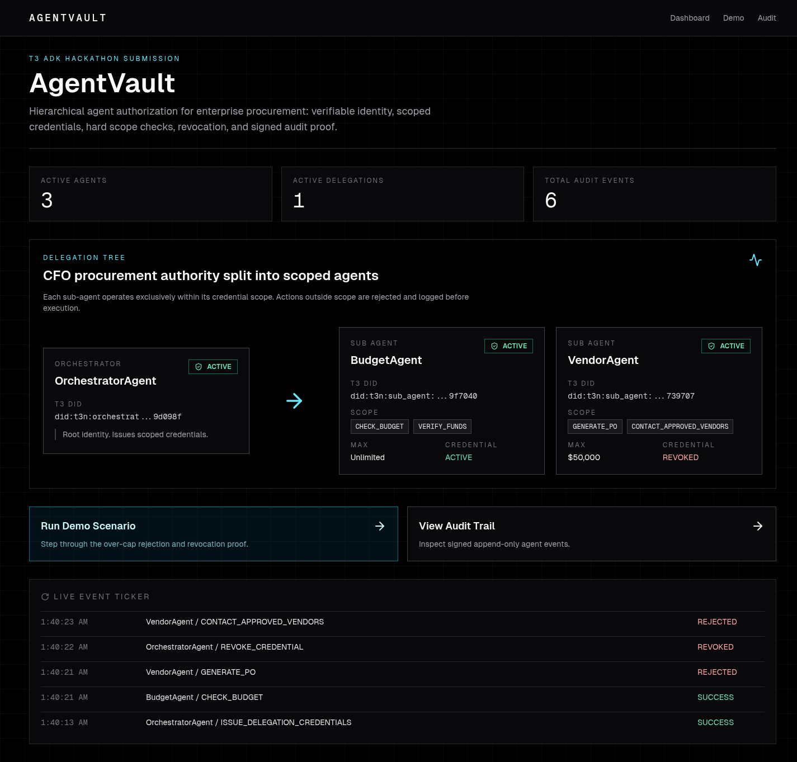
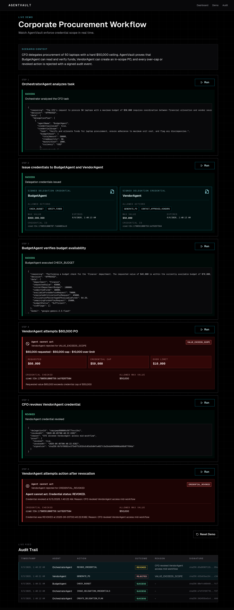
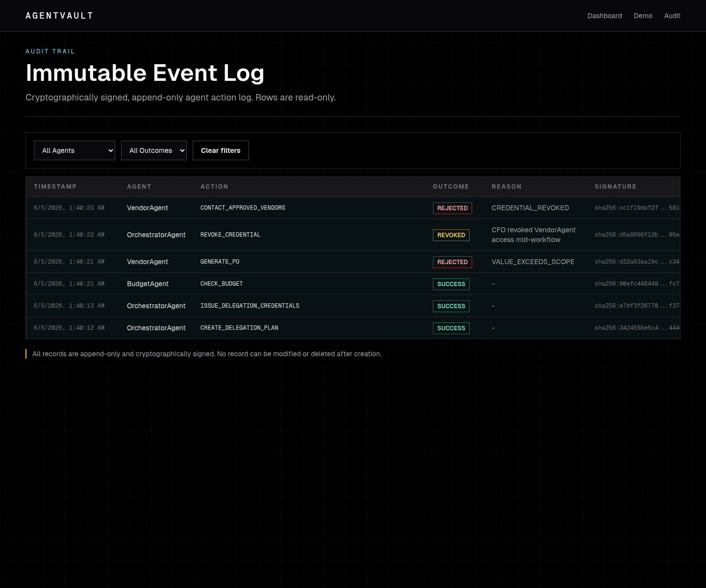

# AgentVault
**Least-privilege authorization for enterprise AI agents — built on Terminal 3 Agent Auth SDK**

*T3 ADK Bounty Challenge · June 2026*

When an AI agent executes a $60,000 purchase order it was never authorized for,
there is no cryptographic proof of what it was supposed to do.

Enterprises deploying AI agents face an impossible choice: give agents full system
access — catastrophic blast radius if the agent hallucinates or is compromised — or
restrict them so tightly they become useless. There is no standard for least-privilege
agent authorization. AWS has IAM for humans. Nobody has IAM for agents.

**AgentVault is that layer.**

It uses Terminal 3's Agent Auth SDK to give every AI agent a verifiable identity and
a scoped delegation credential. Sub-agents can only execute what their credential
explicitly permits. Violations are rejected *before execution*, signed, and written to
an append-only audit trail. One call revokes any agent instantly.

> *"This is AWS IAM for your AI agent stack."*

## Demo

**[▶️ Watch the 42-second demo →](https://samfresh-ai.github.io/agentvault-demo/)**


*Dashboard — delegation tree, active agents, live credential status*


*Step 4 — VendorAgent rejected with VALUE_EXCEEDS_SCOPE before execution*


*Audit trail — append-only, cryptographically signed events*

## Terminal 3 Agent Auth SDK

AgentVault integrates Terminal 3's Agent Auth SDK via the public `@terminal3/t3n-sdk`
package (v3.5.0) and the T3N testnet API key obtained through the Terminal 3 claim flow.

The public SDK currently exposes lower-level `T3nClient`, tenant, contract invocation,
delegation, and revocation primitives. Terminal 3's public docs now show the data-owner
dashboard path for AI agent delegation, including Agent DID, authorized TEE contract,
allowed functions, allowed hosts, and removal. The enterprise Agent Auth scenario in this
submission still needs a higher-level programmatic interface — `agent.create`,
`credential.issue`, `credential.revoke`, `credential.verify` — that the SDK does not yet
expose publicly as a direct app API. Rather than blocking on this gap, AgentVault implements
a clean adapter in
`src/lib/t3-sdk.ts` that defines precisely the interface those methods should have,
with W3C Verifiable Credential output, scoped delegation credentials, and SHA-256 signed
audit records.

Every mock method is marked `// MOCK — replace when Terminal 3 ships this method` with
the expected signature preserved. The adapter is a drop-in replacement target: when
Terminal 3 exposes these methods, swapping in the real SDK requires changing only
`src/lib/t3-sdk.ts`. All 15 SDK integration gaps and the 2026-06-05 SDK/docs recheck are
documented in `bugs.md`.

The mock is not pretending to be production Terminal 3. It mirrors the expected interface, emits W3C-style credentials, creates scoped delegation credentials, and signs audit records with SHA-256 so the demo can prove the authorization model while the SDK gaps are documented in `bugs.md`.

## Local setup

```bash
npm install
npm run prisma:generate
npm run prisma:push
npm run dev
```

Open `http://localhost:3000`.

Required env:

```bash
DATABASE_URL="file:./dev.db"
T3N_API_KEY="..."
T3_NETWORK="testnet"
NEXT_PUBLIC_APP_NAME="AgentVault"
NEXT_PUBLIC_T3_NETWORK="Terminal 3 Testnet"
# Use one live model provider. Anthropic is preferred when both are set.
ANTHROPIC_API_KEY=""
ANTHROPIC_MODEL="claude-sonnet-4-5"
GEMINI_API_KEY=""
# GOOGLE_API_KEY also works for Gemini if GEMINI_API_KEY is not set.
GEMINI_MODEL="gemini-2.5-flash"
```

`ANTHROPIC_API_KEY`, `GEMINI_API_KEY`, or `GOOGLE_API_KEY` is required for the demo. AgentVault intentionally fails the reasoning step when no live model key is configured; it does not fall back to canned agent prose.

Useful verification commands:

```bash
npm run lint
npm run typecheck
npm test
npm run build
npm audit --audit-level=moderate
```

With the app running locally, `npm run security:smoke` checks the core security story:
BudgetAgent can only check budget, VendorAgent cannot exceed its $50,000 cap,
malformed `totalValue` values are rejected, revocation blocks later actions, and
demo reset preserves the audit trail.

## Demo walkthrough

1. Open `/demo`.
2. Run Step 1: OrchestratorAgent analyzes `Procure 50 laptops, max $50,000`.
3. Run Step 2: Orchestrator issues signed scoped credentials to BudgetAgent and VendorAgent.
4. Run Step 3: BudgetAgent verifies budget availability inside scope.
5. Run Step 4: VendorAgent attempts a `$60,000` PO and is rejected with `VALUE_EXCEEDS_SCOPE`.
6. Run Step 5: CFO revokes VendorAgent credential.
7. Run Step 6: VendorAgent attempts another action and is rejected with `CREDENTIAL_REVOKED`.
8. Open `/audit` to inspect signed events and filters.

## Architecture

```text
CFO
 |
 v
OrchestratorAgent -- T3 identity / root credential
 | \
 |  \-- delegation: GENERATE_PO, CONTACT_APPROVED_VENDORS, max $50,000
 |      v
 |   VendorAgent -> scope check -> mock PO or signed rejection
 |
 \-- delegation: CHECK_BUDGET, VERIFY_FUNDS, read-only
     v
  BudgetAgent -> scope check -> budget decision

Every action -> verifyScope -> auditSignature -> AuditLog
```

## Security behavior

AgentVault validates task execution input before any sub-agent business execution.
For value-bearing actions like `CHECK_BUDGET`, `VERIFY_FUNDS`, and `GENERATE_PO`,
`payload.totalValue` must be a finite, non-negative JSON number. Missing values,
strings like `"60000 USD"`, objects, arrays, `null`, `NaN`, and negative values are
rejected before the agent runner is called.

Authorization still lives in `verifyScope()`. LLM output is reasoning only; it cannot
approve, deny, override, or bypass scope checks. Scope failures return structured JSON
with stable reason codes such as `ACTION_NOT_PERMITTED`, `VALUE_EXCEEDS_SCOPE`,
`CREDENTIAL_REVOKED`, and `INVALID_TASK_VALUE`, and rejected sub-agent attempts are
written to the signed audit log.

## Why This Wins

| Judging Criterion | AgentVault's Answer |
|---|---|
| **How big is the problem** | Every enterprise deploying AI agents needs least-privilege authorization. No production standard exists today. This is a foundational infrastructure gap across banking, government, healthcare, and corporate procurement — Terminal 3's named client segments. |
| **How stable is the agent** | All 6 demo steps complete reliably with live Gemini reasoning when a valid key has available provider quota. Scope violations throw hard errors, never silent failures. Missing, invalid, or exhausted model credentials fail loudly instead of falling back to canned prose. `/api/demo/reset` enables repeatable demos without restarting the server. |
| **How creative is the solution** | AgentVault treats the *agent itself* as the identity holder — a scoped, revocable, TEE-backed credential issued to a non-human actor. That is the primitive Terminal 3's enterprise clients actually need. |

## Known limitations

- The public SDK/docs do not expose the exact high-level programmatic Agent Auth methods assumed by the bounty brief, so delegated credential issuance/revocation is mocked behind a replaceable adapter. Terminal 3's docs do now document dashboard-level AI agent delegation and revocation.
- Live model reasoning requires `ANTHROPIC_API_KEY`, `GEMINI_API_KEY`, or `GOOGLE_API_KEY` with available provider quota. Missing, invalid, or quota-exhausted model credentials block Step 1 instead of silently producing deterministic output.
- Demo reset clears transient tasks and restores active demo delegations, but it does not delete audit records. No `/api/audit` update or delete route exists.
- SQLite is local-only and intended for the submission demo, not shared enterprise deployment.

## What This Unlocks

AgentVault in production — with the full Terminal 3 TEE-secured credential chain — enables:

- **Banks**: compliance agents that attest to KYC/AML status without storing raw PII
- **Governments**: citizen service agents with selective-disclosure identity proofs
- **Enterprises**: any multi-agent workflow with cryptographically auditable authorization

The adapter pattern in `src/lib/t3-sdk.ts` is a reference implementation of the
high-level Agent Auth interface Terminal 3's enterprise clients will need. We're ready
to co-build it.
